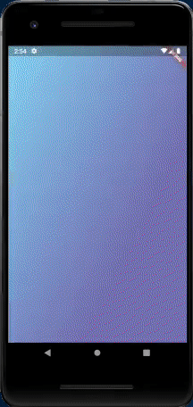

# Raro Journal

Project done during Raro Academy course, as the fourth assignment (LevelUP4)

## About the application

This project consists of a journal, where notes can be added.

## To Do
At the moment the application is still under development, so not all functionalities are done.
- [ ] Search Note
- [ ] Local Database
- [ ] Creation and deletion of notes
- [ ] Favorites
- [ ] Due date 
- [ ] Attachment

## Extra Information
- The layout was done by the design team of Raro Labs.
